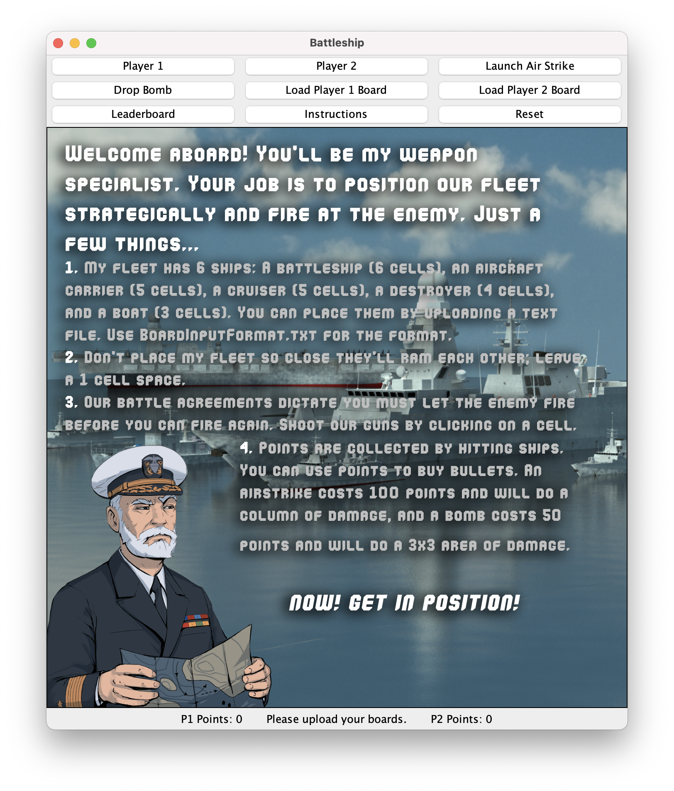
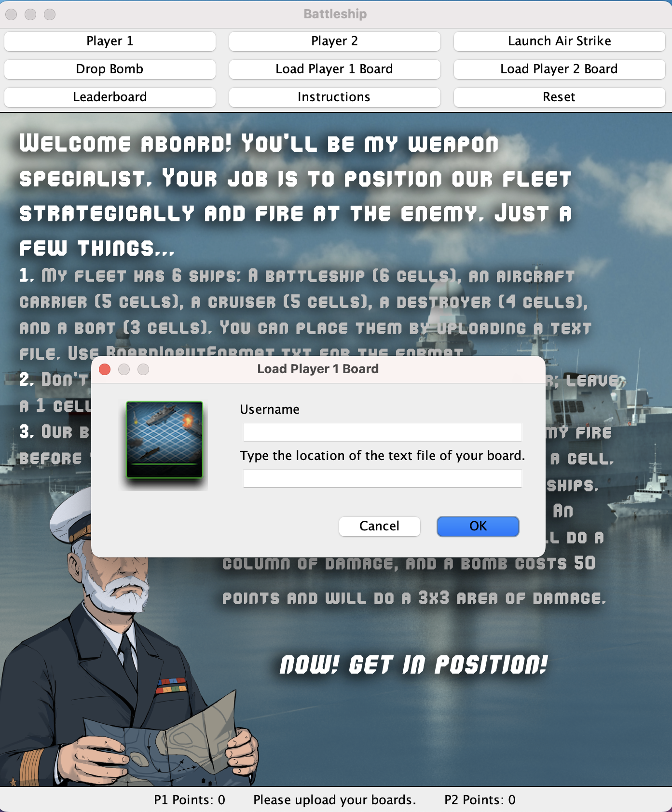
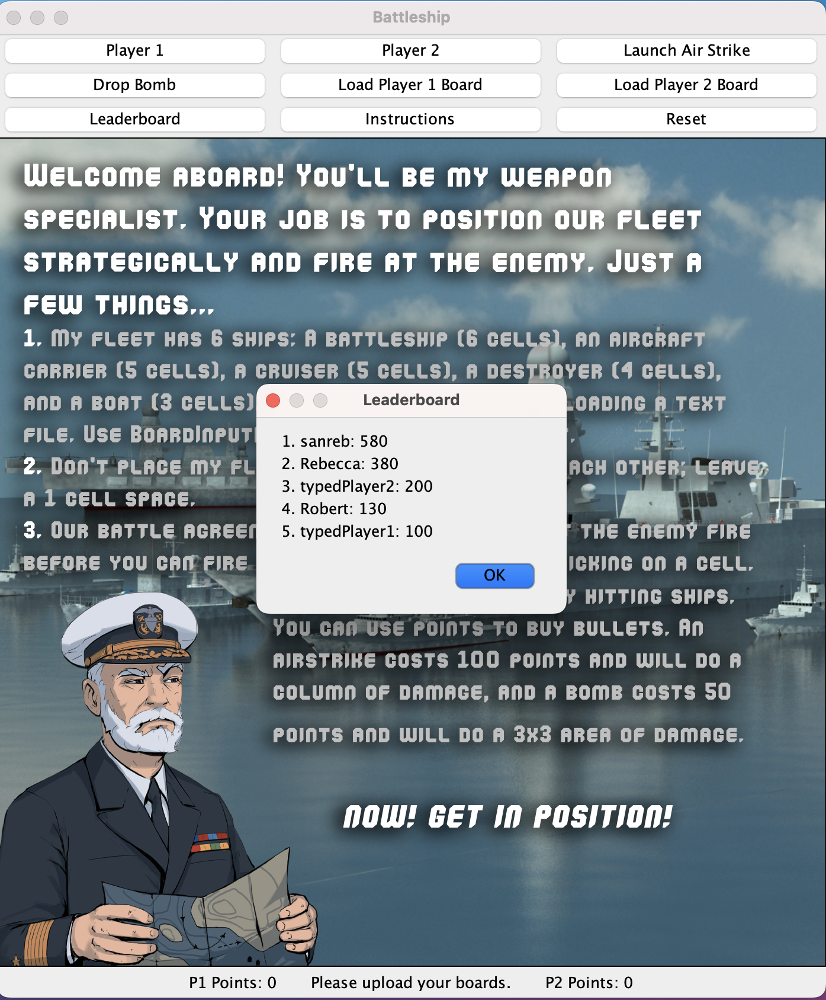
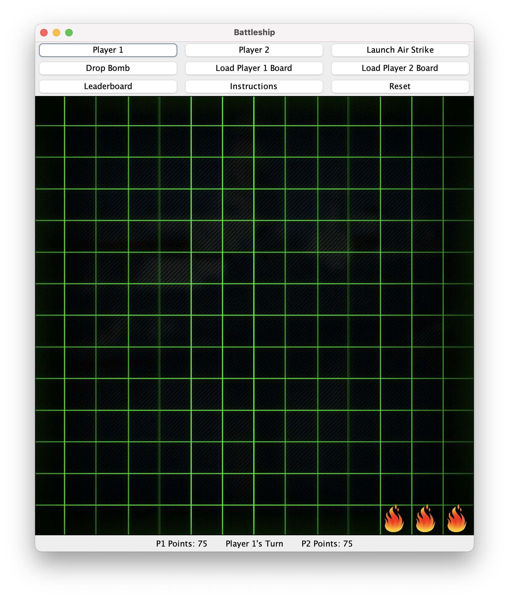
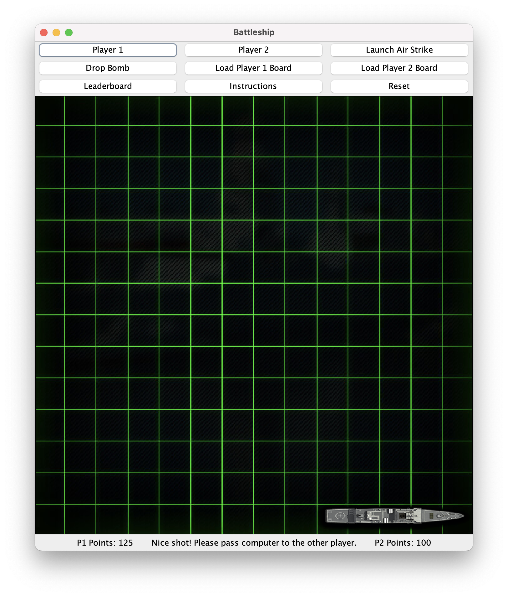
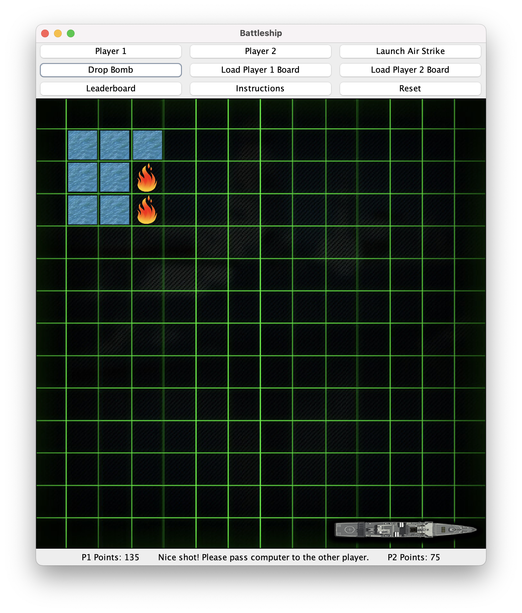
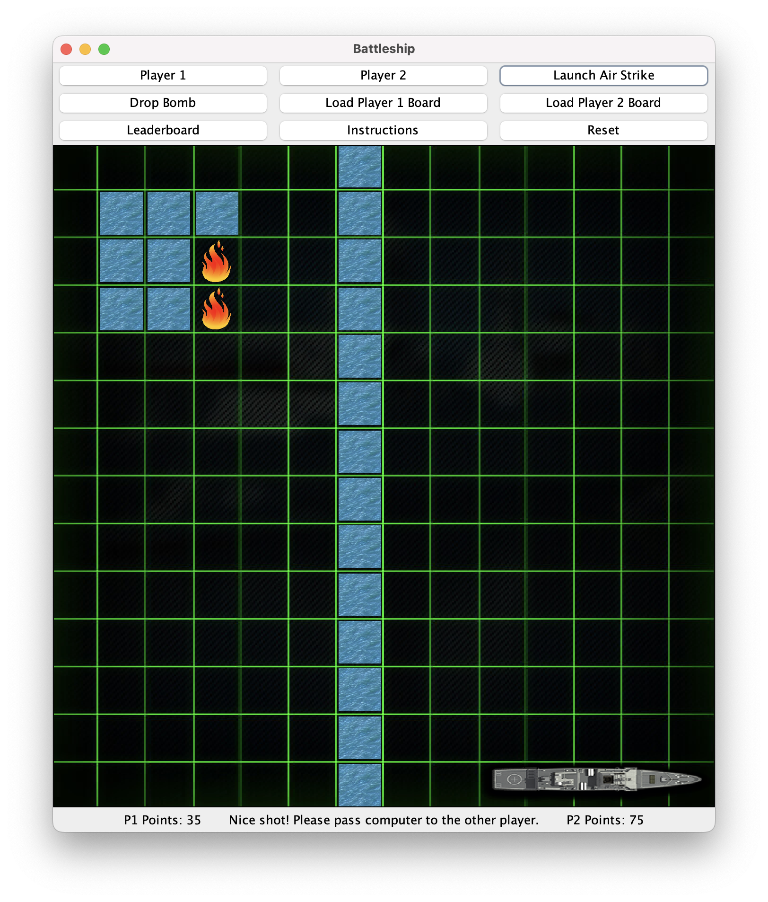
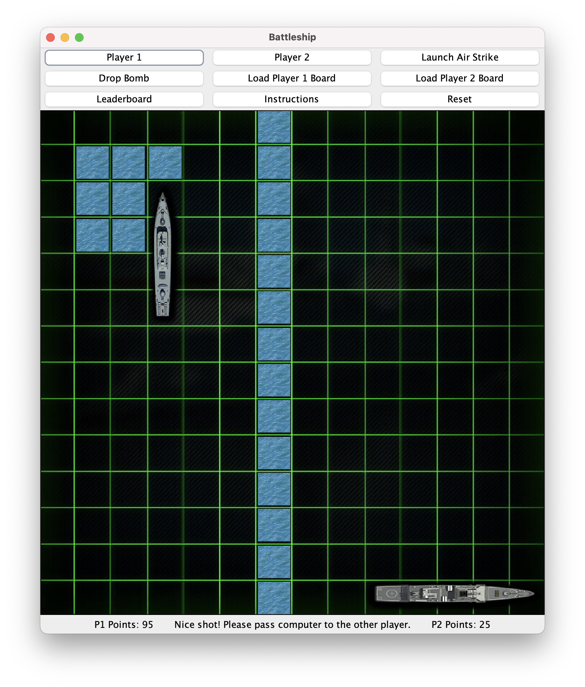

<h1 align="center">
  
    Battleship
  
</h1>
Battleship is a two player strategy and guessing game. This version of Battleship is implemented using the Java Swing library and has several twists on the original design. For example, this game allows users to launch air strikes (which hit an entire column on the board) and drop bombs (hits a 3x3 area) using points collected by hitting ships.

  

## Demos

The instructions appear when you launch the game.

You start the game by creating a username, which is used for the leaderboard, and uploading a .txt file containing your ship positioning. 

&emsp;&emsp;

The leaderboard can be displayed at any points.

&emsp;&emsp;

When you hit a ship, fire appears in the cell where you hit it at.

The entire ship appears when you sink it

Using points (displayed at bottom of the screen), you can drop a bomb...

... or an air strike

You continue playing until all the ships (there are 6 in total) are sunk.

## Core Design Features

 **1. JUnit Testable**
 
Battleship adheres to the MVC design pattern. This means that the model is completely JUnit testable and independent of the GUI. Furthermore, JUnit tests were used in the creation of Battleship and edge cases were considered.

  **2. Inheritance and subtyping**
  
In Battleship, I created an abstract class, Hittable, which is extended by emptyTile (water) and various ship classes. Furthermore, I created an interface, Bullet, which is implemented differently by different bullet types, like a standard bullet, a bomb bullet, or an air strike bullet. In these implementation, the differences are significant, since it requires a re-coded fire method, where air strike bullet fires on an entire column, a bomb bullet fires on a 3x3 box, and a standard bullet fires on a single cell. Dynamic dispatch is also present in the emptyTile class, where it overrides some methods from the Hittable abstract class.

  **3. 2D Arrays**
  
Battleship uses a 2D array to represent the game board in the model. This data structure is appropriate since our game board requires an ordered structure, and the nested, 2D nature when applied to a square game board makes the code readable and simple. In the code, the array is iterated through at various points, like, for example, when checking win state, and entries are accessed at various points, like when playing a turn. The type used in the array is Hittable, an abstract class extended by ships and empty tiles.

  **4. File I/O**
  
File I/O is used for two things. Firstly, it is used to read the game board from a text file when prompted by the user. Secondly, it is used to read from and write to a leaderboard. File I/O is appropriate since the leaderboard is required to store data across game session. File I/O components parse information correctly and writes data to files consistently and correctly.

## Credits
Graphics: 
* http://www.stickpng.com/img/nature/fire/cartoon-fire
* https://worldofwarships.com/en/news/lolz/comic-as-you-are/
* https://graphicriver.net/item/battleship-war-game-assets/20209011

Code:
* FileLineIterator.java was made by the University of Pennsylvania's Computer Science department, specifically the CIS 1200 19fa Development Committee (Alex Seidel, Angela Xi, Daniel Like, Nico Melton, Nicolas Corona, and William Goeller), as part of an assignment but contains much of my own coding created when completing the assignment.
